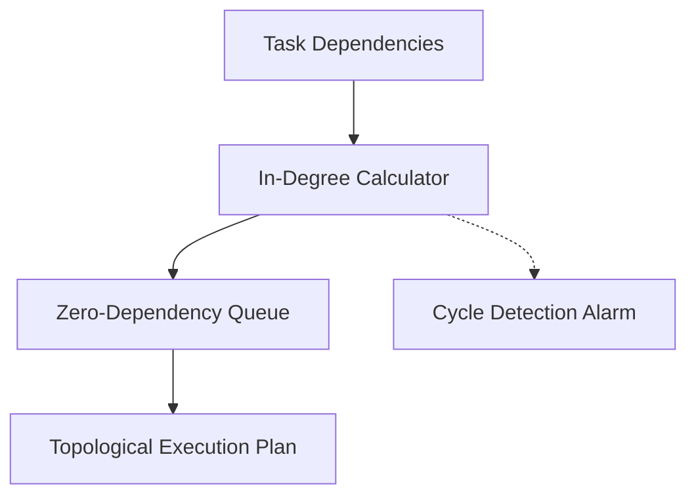

# genpark-dag-topological-sort-dependency-resolver-skill

Kahn topological sorting and cycle detection engine organizing complex multi-agent workflows into valid linear execution orders.

## Architecture

## Features
- **Strict Cycle Detection**: Flags infinite loops and mutual deadlocks.
- **Pure Python**: Zero third-party graph library dependencies.
